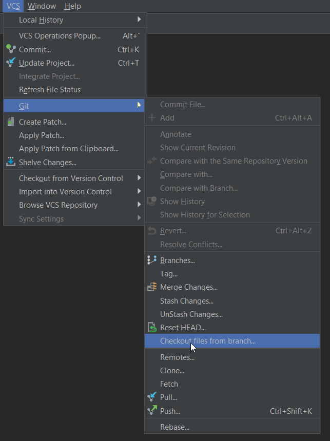
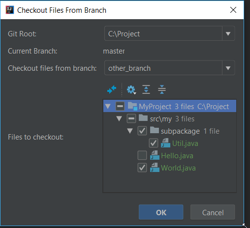
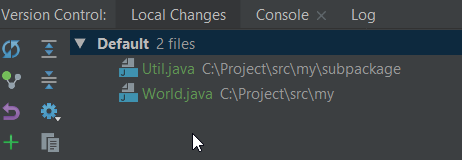

Git Checkout Files From Branch IDEA Plugin
==========================================

Git Checkout Files From Branch is a plugin that allows you to checkout missing files from another git branch. 
It can be used with all Jetbrains IDEs. https://plugins.jetbrains.com/plugin/10795-git-checkout-files-from-branch

Installation
-------------

Search for 'Git Checkout Files From Branch' under File->Settings->Plugins->Browse repositories... or 
download the plugin as jar file from [github][1] and install via File->Settings->Plugins->Install plugin from disk...

Requirements
------------

The plugin supports IDEA 2018.1 and higher

Usage
--------

1) Select VCS -> Git -> Checkout files from branch...
2) Select the branch you want to checkout files from (only branches containing files that do not exist on the current branch are shown)
3) Select the file(s) you want to checkout and click OK
4) The selected files will appear in the "Local Changes" tab and you can now commit them in the current branch 

[1]: https://github.com/ambarth/git-checkout-files-from-branch/blob/master/releases/git-checkout-files-from-branch-0.1.1.jar
[2]: https://plugins.jetbrains.com/plugin/10795-git-checkout-files-from-branch